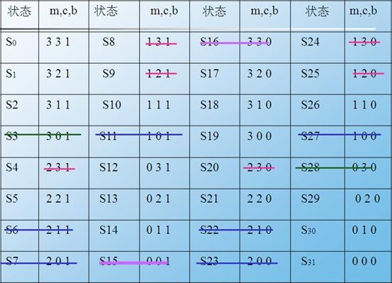

### 修道士野人问题 --状态空间的启发式算法 ###

人物：3个修道士(missionaries)与3个野人(cannials) 道具：1条最多做两人的船
 约束：任何时候在河的两岸上，修道士的人数不能少于野人的个数(m>=c)
 目标：成功地从河的左岸到达河的右岸的方案 (3,3,1)->(0,0,0)

##### 1. 启发式（heuristics）搜索：有些知识或信息可以指导对问题的搜索，扩展最有希望的节点，使问题的状态朝着最有希望的方向进行，提高效率.
有最好优先搜索算法，局部择优算法，A*算法(对估价函数做出一定限制) 
#####
估计(评价)函数f：对当前的搜索状态进行评估，找出一个“最有希望”的节点来扩展。 
K(ni,nj):节点ni和nj之间的最小代价路径的实际值； 
g*(n)=k(s,n):从初始节点s到n的最小代价路径的代价值  
h*(n) :从节点n到目标节点ti的所有k(n, ti)中的最小值  
f*(n)=g*(n)+ h*(n)：是一条从s出发通过n到某个目标节点的一条最小代价路径 
估计函数：f(n)=g(n)+ h(n) 
g (n)为g*(n)的估计：已花代价 
h (n)为h*(n)的估计：将花代价的估计；启发式函数 
f(n)中g(n)比重大，横向趋势 
g(n)比重小，纵向趋势

##### 2. 状态空间表示法 #####

状态：<m,c,b>  
其中m为左岸修道士的个数 
c为左岸野人的个数 
b为左岸船的个数（左：1；右0） 
初始状态：<3,3,1> 
目标状态：<0,0,0> 

 #  #
 
注意：按题目规定条件，应划去非法状态，从而加快搜索效率。

1）首先可以划去左岸边野人数目超过传教士的情况，即S4、S8、S9、S20、S24、S25等6种状态是不合法的；

2）应划去右岸边野人数目超过修道士的情况，即S6、S7、S11、S22、S23、S27等情况；

3）应划去4种不可能出现状态：划去S15和S16——船不可能停靠在无人的岸边；划去S3——传教士不可能在数量占优势的野人眼皮底下把船安全地划回来；划去S28——传教士也不可能在数量占优势的野人眼皮底下把船安全地划向对岸。可见，在状态空间中，真正符合题目规定条件的只有16个合理状态。

（5）当状态数量不是很大时，按问题的有序元组画出状态空间图，依照状态空间图搜索求解

本应该有4*4*2=32种状态，又因为约束条件，只有16种合法状态：(0, 0, 0), (0, 1, 0), (0, 2, 0), (0, 1, 1)
(1, 1, 0), (1, 1, 1),  (1, 2, 0), (1, 3, 1),
  (2, 2, 0), (2, 2, 1),
 (3, 0, 0), (3, 1, 0), (3, 2, 0), (3, 1, 1), (3, 2, 1), (3, 3, 1)。

##### 3. 操作算子(set_of_operation) #####

操作算子可以定义2类：L(m,c)、R(m,c)，分别指示从左岸到右岸的划船操作和从右岸回到左岸的划船操作。由于m和c取值的可能组合只有5个：10，20，11，01，02，故而总共有10个操作算子: 
 F={L01,L10,L11,L02,L20,R01, R10, R11, R02, R20}。

 
 

 运行方法
 win下cmd
 python main.py

